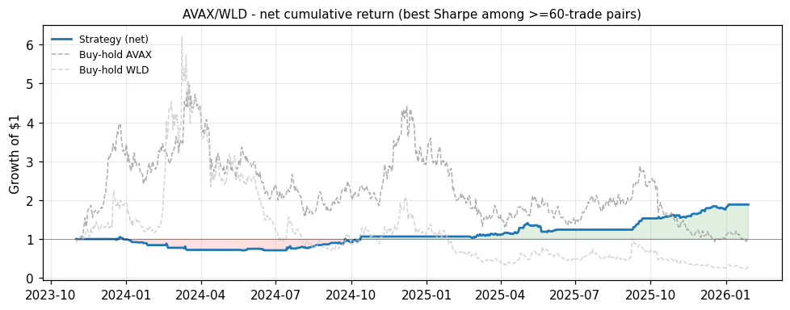

# NEDL Pair Trading

Research implementation of the NEDL cointegration pair trading notebook adapted
for Binance USDT perpetual futures data. The original reference notebooks live in
[`DOC_references/`](DOC_references/).

The strategy fits a cointegration relationship `Y = a + b * X` over a rolling
window by minimizing a KPSS stationarity statistic, then trades the residual:
when the dependent leg (`Y`) diverges far enough from its fair value while the
window is still cointegrated, it goes long the cheap leg and short the rich leg
and holds until mean reversion, a stop-loss, or (optionally) de-cointegration.

## How it works

The repo is a three-stage pipeline; each stage has a CLI entry point.

1. **Download** — `download_data.py` pulls and caches Binance futures klines as
   feather files under `data/feather/`.
2. **Scan** — `scan_pairs.py` runs the strategy across every combination of a
   symbol universe (parallel by default) and ranks pairs by Sharpe / total return.
3. **Backtest** — `backtest.py` runs a single pair end to end and renders a
   metrics dashboard (equity curves, spread, KPSS, signal, drawdown, etc.).

Convention throughout: `symbol0` is the independent variable `X`, `symbol1` is
the dependent variable `Y`. A `+1` signal is long `X` / short `Y`; `-1` is the
reverse.

## Repository layout

| File | Purpose |
| --- | --- |
| `pair_trading.py` | Strategy core: KPSS optimizer, signal generation, position sizing, rolling loop. |
| `backtest.py` | `DataLoader`, `MetricsCalculator`, `Visualizer`, and the single-pair `BacktestEngine`. |
| `scan_pairs.py` | `PairScanner` — parallel/sequential multi-pair scan, ranking, and summary plots. |
| `download_data.py` | Binance futures klines downloader with a per-symbol grace-period cache. |
| `symbol_ranking.py` | Fetches the top-N symbols by 24h volume (with caching and a hardcoded fallback). |
| `utils.py` | `load_config` JSON loader. |
| `config.json` | Default configuration (see below). |
| `test_*.py` | `unittest`-based test suite (run with `pytest`). |
| `DOC_references/` | Original NEDL Part 1 & Part 2 notebooks. |

## Installation

Python 3.10+ is required (the code uses PEP 604 / built-in generic typing). There
is no packaging file; install the dependencies directly:

```bash
pip install numpy pandas scipy statsmodels matplotlib requests pyarrow
```

`pyarrow` is needed for pandas feather I/O.

## Usage

All commands accept `--config` (default `config.json`).

```bash
# 1. Download data for the symbols configured in config.json
python download_data.py
#    ...or specific full-name symbols, bypassing the grace-period cache
python download_data.py --symbols BTCUSDT ETHUSDT --force

# 2. Scan pairs. By default this auto-fetches the top symbols by volume,
#    downloads their data, and runs in parallel.
python scan_pairs.py --top 10
#    Scan a fixed universe sequentially, using only cached data:
python scan_pairs.py --symbols BTC ETH SOL AVAX --no-download --workers 1

# 3. Backtest a single pair and save its dashboard to output/
python backtest.py --symbol0 BTC --symbol1 ETH
```

Useful `scan_pairs.py` flags: `--bidirectional` (test both `A/B` and `B/A`),
`--min-trades`, `--no-plots`, `--no-auto-fetch`, `--debug-errors`, `--fail-fast`.
Results are written to `output/` as CSV + feather, with summary and best-pair
dashboard PNGs.

Run the tests with:

```bash
pytest
```

## Sample result: best pair by Sharpe

Among the pairs that clear the default `min_trades = 60` filter in a scan of the
top-volume universe, **AVAX/WLD** ranks highest by Sharpe ratio. (The unfiltered
nominal leader, `Q/TRX`, has only 49 bars and 5 trades, so its Sharpe is a
small-sample artifact — see [Caveats](#caveats).)

<p align="center">
  
</p>

<table>
  <tr>
    <th align="left">Pair</th><td>AVAX / WLD</td>
    <th align="left">Period</th><td>2023-11-01 → 2026-01-28 (820 bars)</td>
  </tr>
  <tr>
    <th align="left">Sharpe</th><td>1.25</td>
    <th align="left">Sortino</th><td>1.99</td>
  </tr>
  <tr>
    <th align="left">Total return</th><td>+88.6%</td>
    <th align="left">Annualized</th><td>+32.7%</td>
  </tr>
  <tr>
    <th align="left">Max drawdown</th><td>-32.8%</td>
    <th align="left">Calmar</th><td>1.00</td>
  </tr>
  <tr>
    <th align="left">Trades</th><td>67</td>
    <th align="left">Round trips</th><td>37</td>
  </tr>
</table>

Numbers come from `output/pair_scan_results.csv` (net of the configured
`transaction_fee`); reproduce the plot's pair with
`python backtest.py --symbol0 AVAX --symbol1 WLD`.

## Configuration

`config.json` is grouped into top-level data settings plus `strategy`,
`backtest`, and `scan` sections. Key fields:

- **Data** — `symbols` (default pair for `backtest.py`, download list for
  `download_data.py`), `quote`, `interval` (only `1d` is fully supported),
  `start_date` / `end_date`, `feather_dir`, `output_dir`, `binance_base_url`,
  `exclude_incomplete_candles`.
- **Symbol selection** — `auto_fetch_symbols`, `top_n_symbols`,
  `symbol_cache_hours`; set `scan_symbols` to pin a fixed universe instead.
- **Download cache** — `download_grace_hours`, `download_cache_file`.
- **`strategy`** — `window`, `kpss_threshold`, `entry_threshold`,
  `stop_loss_threshold`, `transaction_fee`, `unbiased_formulation`,
  `position_sizing_mode` / `legacy_notebook_sizing`, `stop_loss_cooldown_bars`,
  `exit_on_decointegration`, `divergence_mode`
  (`residual_over_price` or `price_over_fair_value`), `min_fair_value`,
  `beta_loading` / `beta_proxy_symbol`.
- **`backtest`** — `initial_capital`.
- **`scan`** — `min_trades`, `scan_bidirectional`, `debug_errors`, `fail_fast`.

## Defaults

- The rolling loop is no-lookahead: parameters are fit on `t-window:t`, signals
  are generated at `t`, and returns are realized over `t -> t+1`.
- Standard positions use `position_sizing_mode = "gross_normalized"` by default,
  so long and short legs sum to one gross dollar. Set
  `legacy_notebook_sizing = true` or `position_sizing_mode = "legacy_notebook"`
  to recover the notebook-style `+1/-1` legs.
- Stop-loss exits start a same-direction cooldown controlled by
  `stop_loss_cooldown_bars`.
- Signals are blocked when the optimized fair value is non-finite, negative, or
  near zero. The default entry gate uses `abs(price_y - fair_value) / price_y`.
- Metrics mark a run invalid when equity crosses zero instead of letting Sharpe,
  Sortino, or Calmar silently become `NaN`.

## Caveats

- Scanner symbols are selected by current Binance futures volume when
  `auto_fetch_symbols` is enabled. Backtesting those symbols over full history
  has selection lookahead and survivorship bias.
- The default `transaction_fee` is optimistic for many live futures workflows.
  Treat it as a research assumption and configure it for your venue/order type.
- Generated files in `output/` and cached data in `data/` are local research
  artifacts. Keep or ignore them depending on whether reproducible cached data is
  part of the experiment you want to version.

## References

This implementation is based on the NEDL YouTube channel's cointegration pair
trading series:

- [Part 1](https://youtu.be/x_xoq6eY85s?si=3X0U4uaYFF3qFgVg)
- [Part 2](https://youtu.be/jvZ0vuC9oJk?si=UhpDBKR-eeLVrJP_)
